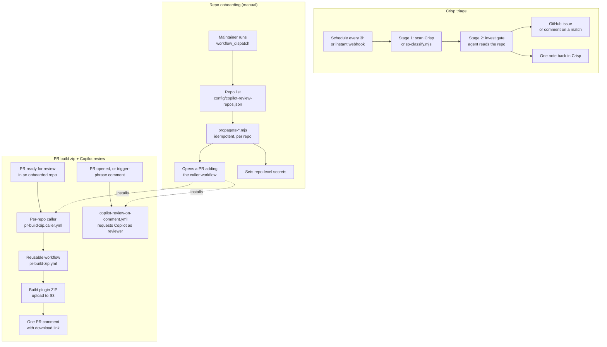
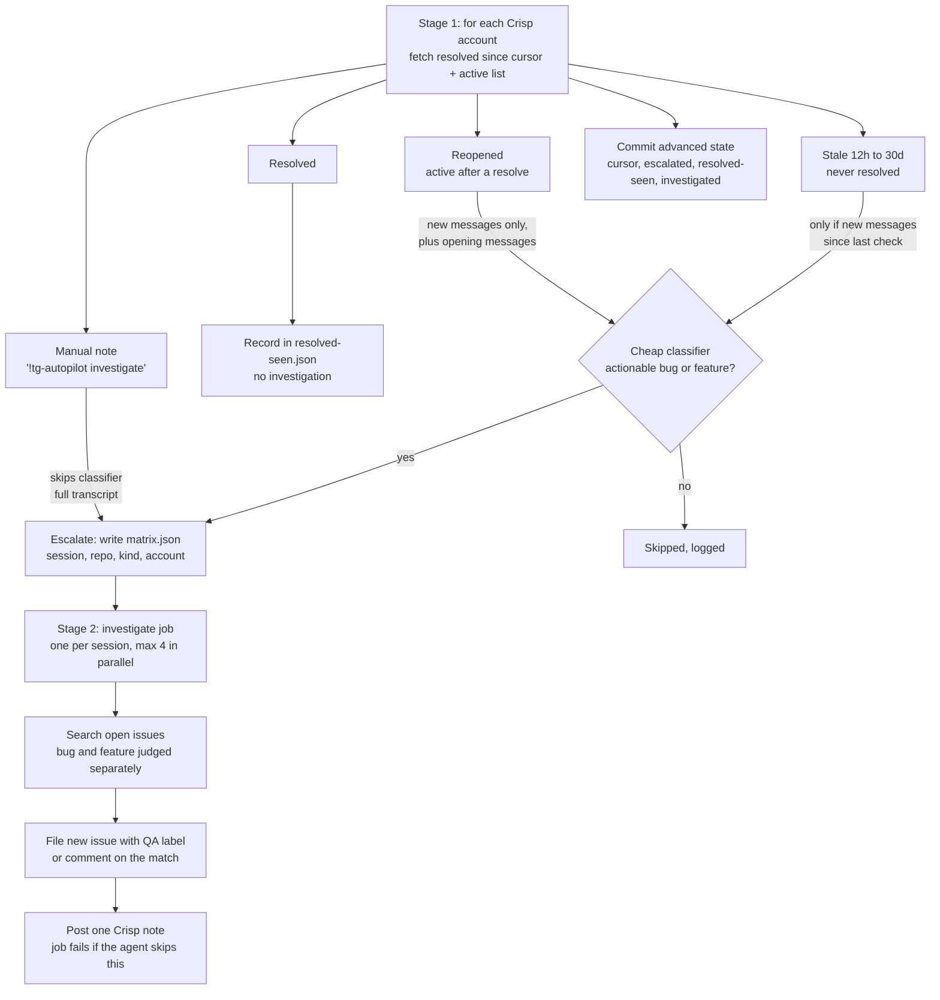

# Architecture

A map of how tg-autopilot works, for someone new to the repo. Diagrams are Mermaid, so GitHub renders them inline. For the *why* behind each rule, follow the links to [PHASE2-SETUP.md](PHASE2-SETUP.md) and the dated entries in [CHANGELOG.md](CHANGELOG.md).

There is no server. Everything is a GitHub Actions workflow running under one machine user, `tg-autopilot`.

## 1. The three lanes

Shared by all three: the machine user, two org-scoped tokens (`BOT_TOKEN` for `wpeverest`, `BOT_TOKEN_THEMEGRILL` for `themegrill`), and committed state in `state/`. See the README's "How the cross-org access works".

## 2. Crisp triage: which conversations get investigated

Policy in one line: **a resolved conversation is trusted as handled and never investigated on its own.** Only three things escalate one. Full reasoning: [PHASE2-SETUP.md § 4c](PHASE2-SETUP.md#4c-what-actually-triggers-a-full-investigation).

Also part of the scheduled run: `crisp-dedupe-active.mjs` checks active conversations against open issues. It never files a new issue, only comments on an existing match and notes the Crisp conversation.

`crisp-investigate-now.yml` is the instant path. A Crisp webhook (via n8n) fires `repository_dispatch`, and `crisp-resolve-dispatch.mjs` resolves that one session to a repo, then runs the same Stage 2.

## 3. Where each file fits

| File | Role |
|---|---|
| `scripts/crisp-classify.mjs` | Stage 1 orchestrator: the four paths above, writes `matrix.json` and state |
| `scripts/crisp-classifier.mjs` | Cheap AI call: actionable? bug or feature? which product/repo? |
| `scripts/crisp-client.mjs` | Crisp API wrapper (retries on 401/429), manual-note counting |
| `scripts/crisp-dedupe-active.mjs` | Match active conversations to open issues, notify both sides |
| `scripts/crisp-resolve-dispatch.mjs` | Instant single-session path |
| `scripts/crisp-fetch-transcript.mjs`, `build-prompt.mjs` | Stage 2 setup: transcript into the agent prompt |
| `scripts/crisp-post-note.mjs` | The agent's mandatory last step: note back in Crisp |
| `scripts/summarize-investigation.mjs` | Turns the agent's raw output into a readable run summary |
| `scripts/seed-escalated.mjs` | One-time seed when onboarding a new Crisp account |
| `scripts/events.mjs`, `events-parse.mjs`, `emit-investigation-event.mjs`, `pricing.mjs` | Best-effort event log to a private data repo (for the dashboard); parse outcome from the Crisp note, estimate cost |
| `scripts/github-client.mjs`, `openai-client.mjs` | Thin API helpers |
| `scripts/propagate-*.mjs` | Roll workflows and secrets out to every repo |
| `prompts/crisp-triage-agent.md` | The Stage 2 agent's instructions |
| `config/inbox-to-repo.json` | Crisp account/product to GitHub repo routing |
| `state/*.json` | The pipeline's only memory; committed after each run |
| `.github/workflows/` | Entry points: `crisp-triage.yml`, `crisp-investigate-job.yml`, `crisp-investigate-now.yml`, `pr-build-zip*.yml`, `copilot-review-*.yml`, `propagate-*.yml`, `seed-escalated.yml` |

## 4. Before you change something

- Check [`skills/`](skills/) first: playbooks for onboarding, debugging, and verifying changes.
- Read the comment attached to a line before editing it; the gotchas live there.
- "Has anything new happened?" checks must use real message timestamps, never conversation-level `active.last` / `updated_at`.
