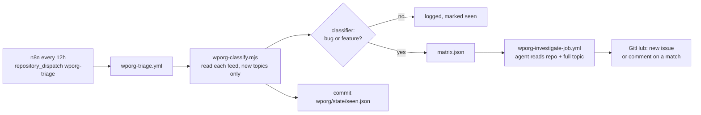

# WordPress.org forum triage

Checks the public wp.org support forum of each of our free plugins/themes, classifies new topics, and has an agent file a GitHub issue (or comment on an existing matching one). Same Stage 1 / Stage 2 idea as the Crisp pipeline, but everything lives here and `crisp-*` files and state are never touched. Shared, reused as-is: `scripts/openai-client.mjs`, `scripts/pricing.mjs`, `scripts/build-prompt.mjs`, `scripts/summarize-investigation.mjs`.

## Policy

- Input: `https://wordpress.org/support/{plugin|theme}/<slug>/feed/` (public RSS, no auth), then the topic page for the full thread including replies. Our own support replies are labelled in the transcript.
- Only **new** topics are looked at. The first run for a product only records what already exists (`seeded`), so onboarding never floods Stage 2 with a backlog. **Resolved topics are skipped** (read from the forum list page's resolved marker; if that page can't be fetched, nothing is treated as resolved). Topics created more than 14 days ago (`MAX_AGE_DAYS`, by creation date, not last reply) that were never seen are marked seen and skipped. At most 10 escalations per run; the rest are marked seen and can be run manually.
- Same rules as Crisp Stage 2: bug and feature judged separately, existing issue -> comment (a feature needs an exact-capability match), otherwise new issue with `manual-qa-required` / `qa-verified`. Only a `product_bug` root cause may be filed; `conflict` / `host` / `user_error` / `undetermined` file nothing.
- **Nothing is ever written to wordpress.org** (no official API, and bot replies there risk trouble with the plugin team). The agent's report goes to the job log / step summary only. There is no draft reply.
- **Where issues are filed**: in the product's `-pro` repo when it has one, otherwise in the free repo (`issue_repos` in `config/products.json`, derived from `config/inbox-to-repo.json`). The agent still reads the **free** repo's code, since the forum is about the free edition, and searches both repos for existing issues. Pro repos are private, so only the team sees these issues. Before the agent runs, the job checks that the bot token can write issues to that repo (by creating the QA label); if not it fails loudly, with no silent fallback to another repo. Re-run the topic with the manual dispatch after fixing the PAT's repository access.
- Issues link back with `Source: [WordPress.org forum topic](url)` and must not copy usernames, emails, site URLs or license keys.

## Trust

Topics are written by the public. The agent prompt fences the topic as untrusted data and restricts allowed commands, but this is a prompt-level defence only: the agent still runs with the repo token (`--auto`). Do not give this workflow broader credentials than the Crisp one has, and review the first filed issues by hand.

## Triggering

- **n8n**: a Schedule node every 12h -> HTTP Request `POST https://api.github.com/repos/themegrill/.github/dispatches`, headers `Authorization: Bearer <token with repo scope>`, `Accept: application/vnd.github+json`, body `{"event_type":"wporg-triage"}`. There is deliberately no `schedule:` in the workflow, so n8n is the only clock (also avoids GitHub's dropped scheduled runs).
- **Manual**: Actions -> "WP.org forum triage" -> Run workflow. Leave inputs empty for a normal scan, or give `topic_url` + `repo` (+ `kind`) to investigate exactly one topic, e.g. to retry a failed one or one over the per-run cap.

## Files

| File | Role |
|---|---|
| `config/products.json` | wp.org slug -> free GitHub repo (plugins and themes). Edit to onboard |
| `state/seen.json` | `seeded` per product + `topics` already handled (pruned after 90d). Data, don't hand-edit |
| `scripts/wporg-forum.mjs` | Feed / topic-page parsing, fetch with retry. Regex-based and defensive; has tests |
| `scripts/wporg-classify.mjs` | Stage 1 |
| `scripts/wporg-classifier.mjs` | Cheap AI call, forum-specific prompt |
| `scripts/wporg-fetch-transcript.mjs` | Stage 2 input: full thread as text |
| `scripts/wporg-done.mjs` | Agent's mandatory last step; `wporg-check-done.mjs` fails the job unless a real tool call to it is in the agent output, and prints the report to the job log |
| `scripts/wporg-build-prompt.mjs` | Fills `prompt.md` (own copy so Crisp's `build-prompt.mjs` is untouched; topic text is substituted last, never re-expanded) |
| `prompt.md` | Stage 2 agent instructions (derived from `prompts/crisp-triage-agent.md`; keep rules in sync by hand) |
| `../.github/workflows/wporg-triage.yml`, `wporg-investigate-job.yml` | Entry point and reusable Stage 2 |

## Known limits

- A topic skipped as resolved is not looked at again, even if it is re-opened or gets new replies. Investigate it by hand with the manual dispatch (`topic_url` + `repo`).
- A failed investigation is not retried by the next scan (the topic is already marked seen, same as Crisp's escalated list). Re-run it manually.
- Replies posted after a topic is first seen are not re-examined; only new topics trigger work.
- `libreria`, `ornatedecor`, `skincare` have no wp.org forum feed under those slugs and are not covered.
- Scraping the topic page depends on bbPress markup; if it changes, `wporg-fetch-transcript.mjs` fails loudly ("Could not parse any posts") instead of investigating blind.
- Needs the same secrets/vars as Crisp: `OPENAI_API_KEY`, `BOT_TOKEN`, `BOT_TOKEN_THEMEGRILL`, optional `CLASSIFY_MODEL`, `INVESTIGATE_MODEL`. No Crisp credentials.
